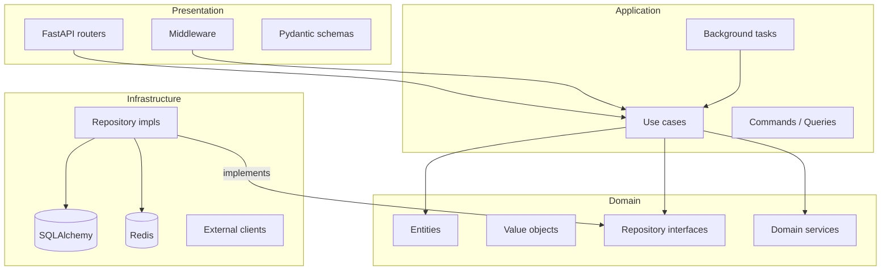

# Architecture

Gunther API follows Clean Architecture — dependencies point inward,
the domain layer has no external dependencies.

## Layer diagram



## Directory structure

```
src/app/
├── domain/
│   ├── <domain>/
│   │   ├── entities.py       # Dataclasses, no ORM coupling
│   │   ├── value_objects.py
│   │   ├── repository.py     # Abstract base class
│   │   └── services.py       # Pure domain logic
│   └── shared/
├── application/
│   └── <domain>/
│       ├── commands.py       # Mutating use cases
│       ├── queries.py        # Read use cases
│       └── tasks.py          # ARQ background tasks
├── infrastructure/
│   ├── database/
│   │   └── <domain>/
│   │       ├── models.py     # SQLAlchemy ORM models
│   │       └── repository.py # Concrete implementation
│   ├── cache/                # Redis helpers
│   └── security/             # JWT helpers
└── presentation/
    └── api/
        └── v1/
            └── <domain>/
                ├── router.py
                └── schemas.py
```

## Dependency injection

Dependencies are wired in `src/app/presentation/dependencies.py` using FastAPI's
`Depends()`. Database sessions and repository instances are scoped per HTTP request.

## Conventions

- Entities are plain Python dataclasses — no SQLAlchemy in the domain layer
- Use cases receive repository interfaces via constructor injection
- All I/O operations are `async`
- Response schemas (out) and request schemas (in) are separate Pydantic models
